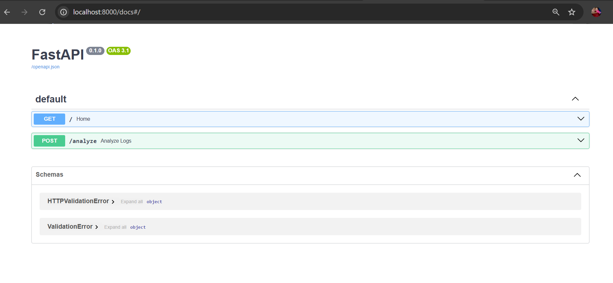
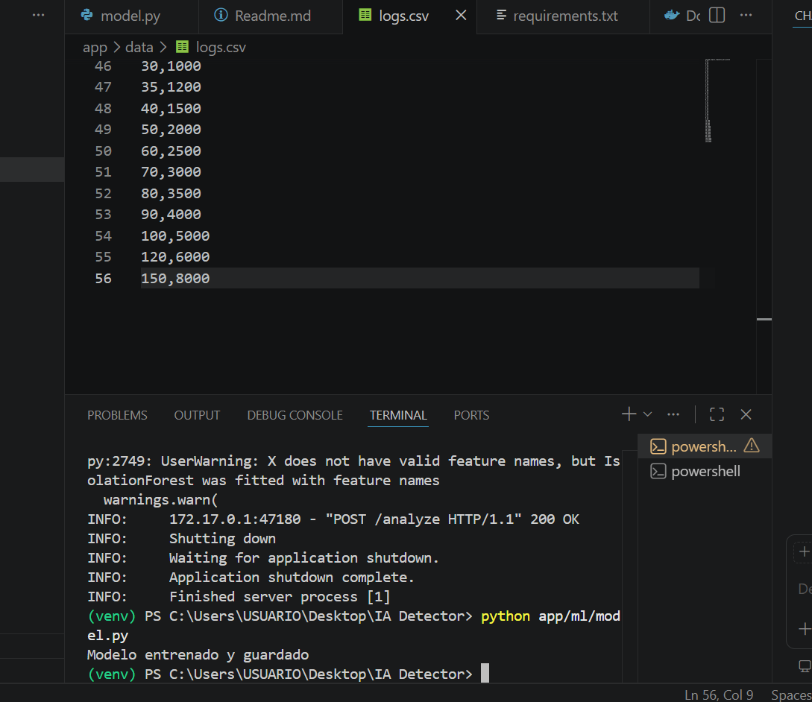
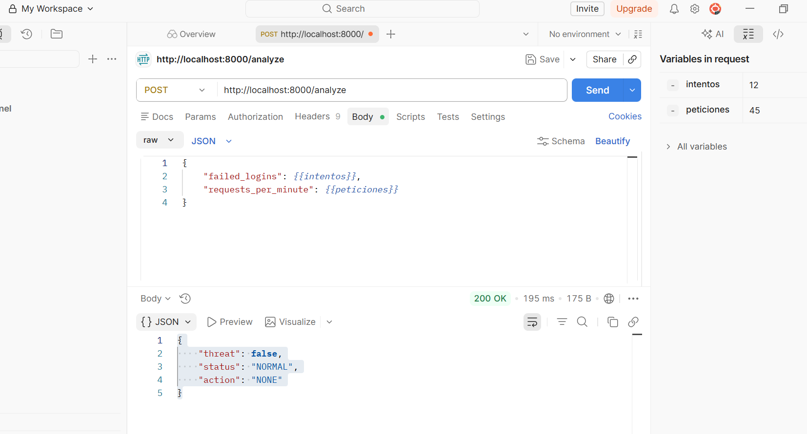
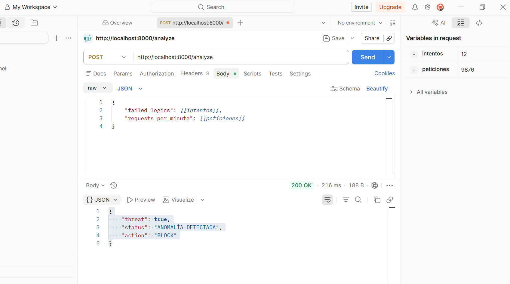
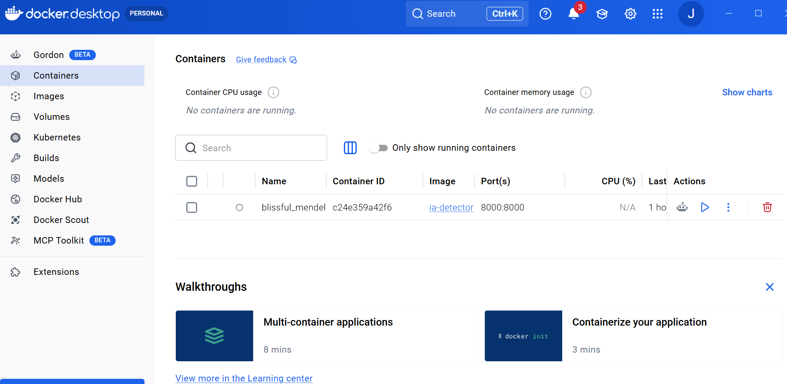

# Arquitectura

La solución implementa una arquitectura modular basada en agentes especializados para el análisis inteligente de logs de acceso.

Componentes principales:

- FastAPI como backend REST
- Agente de ingestión para procesamiento y limpieza de logs
- Motor IA basado en Isolation Forest
- Agente de decisión para clasificación de amenazas
- Docker para despliegue portable

# Flujo de Agentes

Cliente
↓
POST /analyze
↓
Ingestion Agent
↓
Preprocesamiento de datos
↓
Modelo IA (Isolation Forest)
↓
Decision Agent
↓
Respuesta JSON

# Agentes

## Ingestion Agent

Responsable de:
- recibir logs
- validar datos
- limpiar información
- transformar features

## Decision Agent

Responsable de:
- interpretar resultado del modelo IA
- clasificar amenazas
- sugerir acciones como:
  - BLOCK
  - ALERT
  - IGNORE

  # Evidencias

## Swagger

## Modelo Entrenado

## Tráfico Normal

## Amenaza Detectada

## Docker

# Ejecución Local

## 1. Crear entorno virtual

python -m venv venv

## 2. Activar entorno virtual

Windows:

venv\Scripts\activate

## 3. Instalar dependencias

pip install -r requirements.txt

## 4. Ejecutar API

uvicorn app.main:app --reload

# Ejecución con Docker

## 1. Construir contenedor

docker compose build

## 2. Ejecutar proyecto

docker compose up

## 3. Acceder a Swagger

http://127.0.0.1:8000/docs

# Tecnologías

- Python 3.11
- FastAPI
- Scikit-learn
- Pandas
- Docker
- Uvicorn

# Modelo de IA

Se utilizó Isolation Forest para detección de anomalías no supervisada.

El modelo aprende patrones normales de tráfico y detecta comportamientos anómalos como:
- múltiples intentos fallidos
- tráfico excesivo
- comportamiento atípico

# Endpoint Principal

POST /analyze

# Request Ejemplo
{
  "failed_logins": 25,
  "requests_per_minute": 900
}

# Response Ejemplo

{
    "threat": true,
    "status": "ANOMALÍA DETECTADA",
    "action": "BLOCK"
}